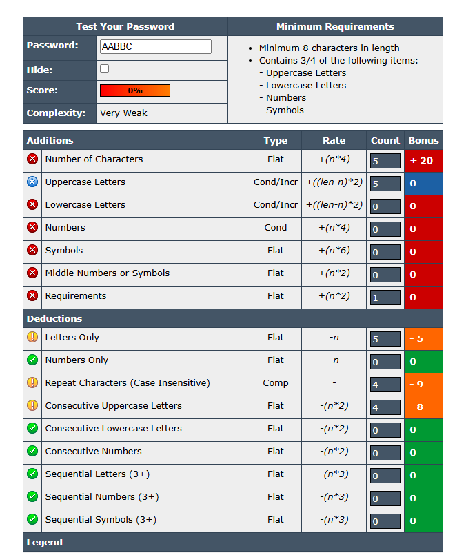
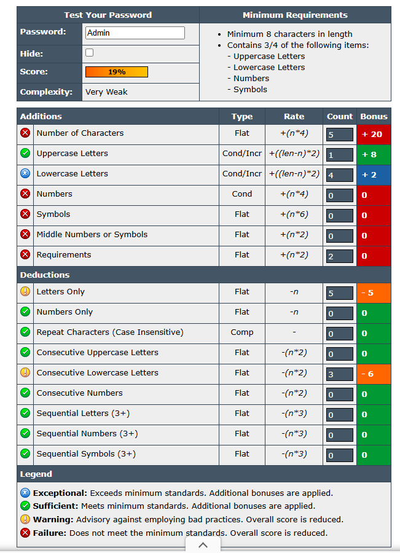
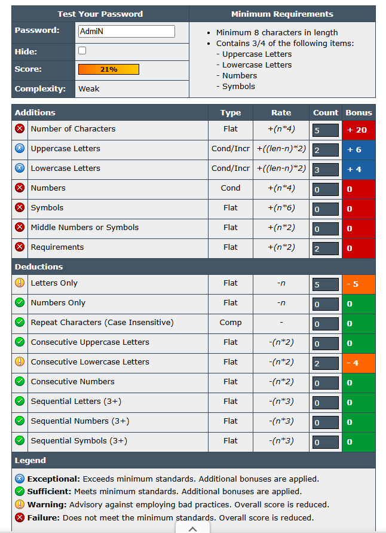
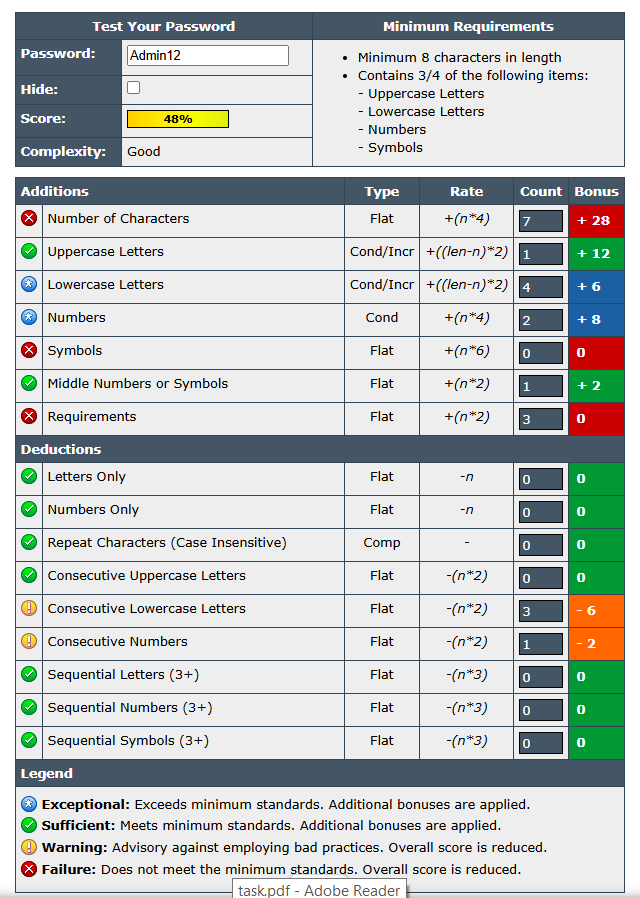
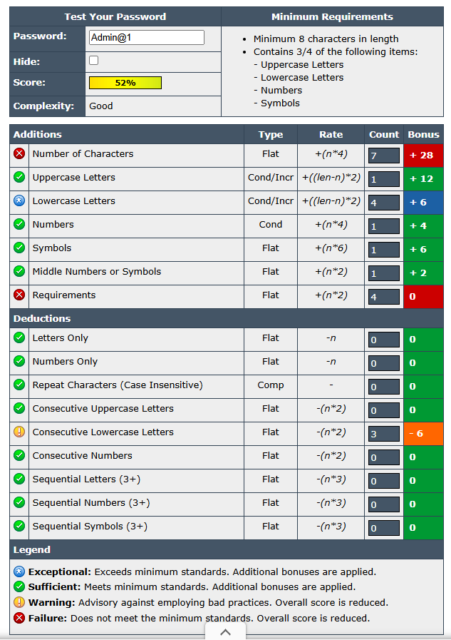
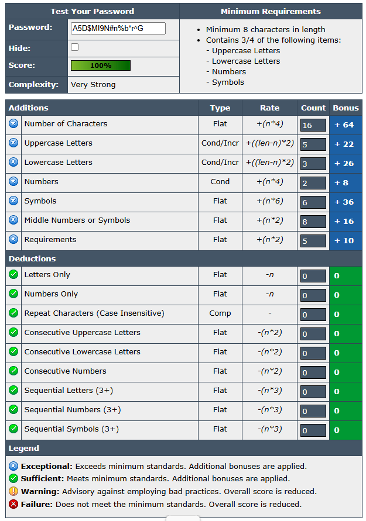

#Task 6 : Create a Strong Password and Evaluate Its Strength.

#Objective: Understand what makes a password strong and test it against password strength tools.
#Tools: passwordmeter.com (Online free password strength checkers)

Created multiple passwords with varying complexity.

1. Uppercase Password Strength Details

3. Lowercase Password Strength Details

4. One Uppercase Other Small Strength Details

5. Multiple Upper & Lower Case Strength Details

6. Number With Upper Lower Case Strength Details

7. Using Symbols With Numbers Strength Details

8. Created a strong password using Upper, lower, Number, Symbols & 8 or morethan 8 charcter length covered

#Outcome: Understanding password security and best practices.
